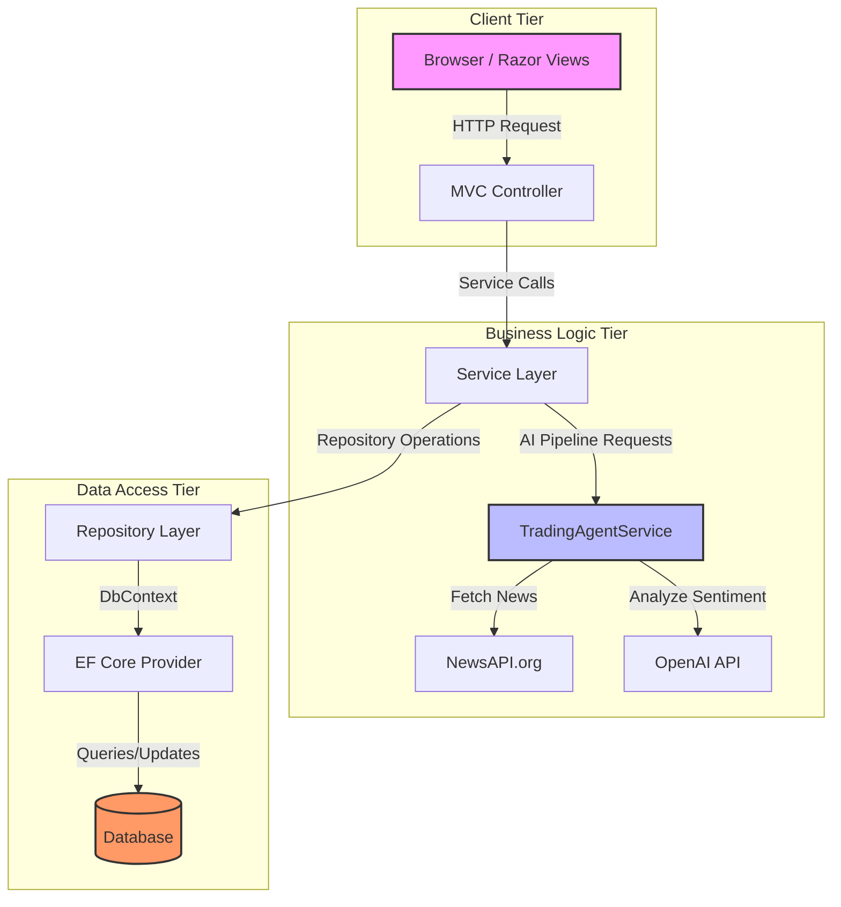
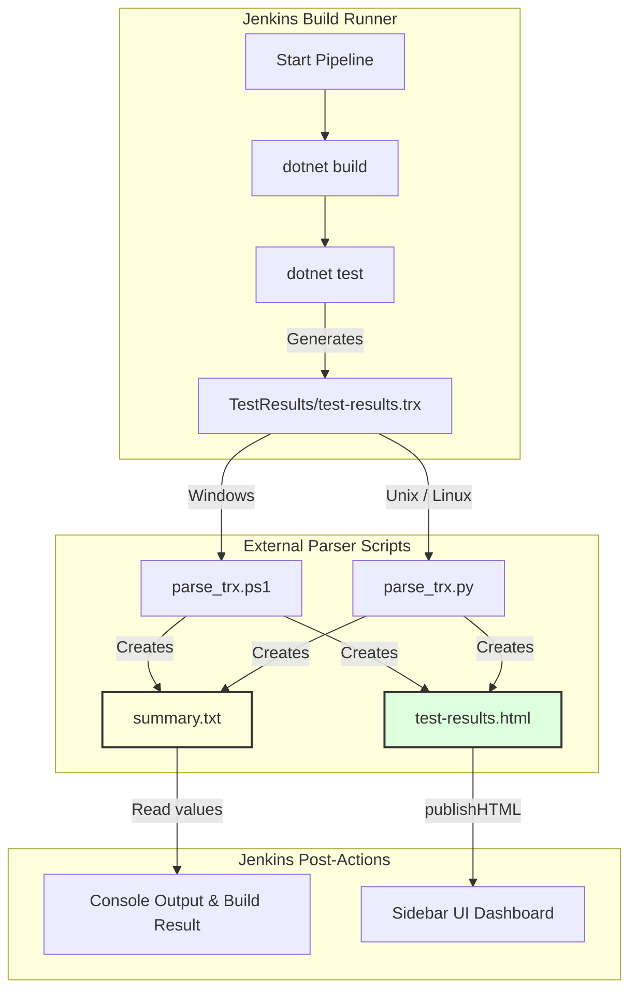

# 📰 FUNewsTradingSystem

<div align="center">
  
  [](#cicd-pipeline)
  [](https://dotnet.microsoft.com/)
  [](#database-setup)
  [](#ai-trading-pipeline)
  [](#license)

  **An automated, AI-powered financial market news analysis and trading decision web application.**
  
  *Built with ASP.NET Core MVC (.NET 10), EF Core, and OpenAI GPT-4o.*

  🌐 **Live Deployment:** [funewstradingsystem.onrender.com](https://funewstradingsystem.onrender.com)
</div>

---

## 📌 Table of Contents
- [System Architecture](#-system-architecture)
- [Tech Stack](#-tech-stack)
- [Key Features & Role-Based Access](#-key-features--role-based-access)
- [Interactive CI/CD Pipeline](#-interactive-cicd-pipeline)
- [Folder Structure](#-folder-structure)
- [Getting Started](#-getting-started)
- [Database Setup](#-database-setup)
- [Docker & Containerized Deployment](#-docker--containerized-deployment)
- [Default System Credentials](#-default-system-credentials)
- [Disclaimers & Limitations](#-disclaimers--limitations)

---

## 🏗️ System Architecture

The project follows a strict **3-Tier Layered Architecture** pattern to isolate concerns and make the codebase modular:



- **Presentation Layer (MVC)**: Implements HTTP pipeline processing, Razor views, routing, form validation, and session/cookie-based claims auth.
- **Business Logic Layer (BLL)**: Controls the core orchestration, repository interfaces, and the **AI Trading Pipeline** which fetches news and executes OpenAI reasoning.
- **Data Access Layer (DAL)**: Exposes entities, migrations, and `FUNewsManagementContext` mapping C# classes to physical DB tables.

---

## 🛠️ Tech Stack

* **Runtime & Framework**: `.NET 10.0`, `ASP.NET Core MVC`
* **Object-Relational Mapping (ORM)**: `Entity Framework Core 10`
* **Relational Database Management (RDBMS)**:
  * **Development**: SQL Server (LocalDB / Express)
  * **Production**: PostgreSQL (Optimized for Onrender)
* **AI & API Providers**:
  * **OpenAI API**: Chat Completions with `gpt-4o`
  * **NewsAPI**: Financial headline aggregator
* **Front-end Technologies**: HTML5, CSS3 (Custom Glassmorphism design tokens), Bootstrap 5.3, JavaScript
* **Continuous Integration**: Jenkins Pipeline using PowerShell/Python XML TRX test parsers

---

## 👥 Key Features & Role-Based Access

The system enforces strict role-based access control (RBAC) using ASP.NET Core Policy Authentication:

```mermaid
gantt
    title System Access Matrix
    dateFormat  X
    axisFormat %s
    section Lecturer / Guest
    Public Feed Reports           :active, 0, 10
    section Staff
    Run AI Sector Analysis        :active, 0, 20
    Category & Parent Categories  :active, 0, 20
    Ticker Tag Normalization      :active, 0, 20
    Personal Reports Archive      :active, 0, 20
    Profile Management            :active, 0, 20
    section Admin
    Full Account Management       :active, 0, 30
    Statistical Reporting Tools   :active, 0, 30
```



### 🛡️ Admin (Role 3)
* **Account Management**: Manage all user records. Built-in server-side prevention of self-deletion.
* **Statistical Audits**: Filter and export report analytics based on date ranges (sorted in reverse chronological order).

### ✍️ Staff (Role 1)
* **AI Analysis Agent**: Trigger news fetches for a Category/Tag combination. Prompt OpenAI for analysis and save recommendations.
* **Category Tree Management**: Configure sectors, toggle active status, and soft-delete nodes.
* **Tag Management**: Normalizes tickers to uppercase to avoid duplication.
* **Personal Dashboard**: View and toggle personal reports between active and archived.

### 🎓 Lecturer (Role 2)
* **Read-Only Access**: View published analyses. No editing or pipeline control rights.

---

## 🔄 Interactive CI/CD Pipeline

The project features a **Jenkins** automation pipeline designed for secure, sandbox-compliant test reporting on both Windows and Unix build nodes:



1. **Test Stage**: Runs standard unit tests (`dotnet test`) and outputs results in Microsoft XML format (`.trx`).
2. **Parser Stage**: Standard sandbox-restricted Groovy code cannot easily parse XML in Jenkins without security approval. To resolve this, the pipeline delegates XML processing to OS-level PowerShell or Python scripts.
3. **Output Generation**:
   - **`summary.txt`**: Plain key-value statistics (`total=115\npassed=115...`) used by Jenkins to dynamically update build status.
   - **`test-results.html`**: A fully responsive, dark-themed HTML report displaying test case execution, error logs, search bars, and status filters.

---

## 📁 Folder Structure

```
PRN222_Project_FUNewsTradingSystem/
├── FUNewsTradingSystem.sln            # Solution Entry File
├── Dockerfile                         # Production Multi-stage Build configuration
├── Jenkinsfile                        # Jenkins Pipeline script
├── parse_trx.ps1                      # Windows test parser
├── parse_trx.py                       # Linux / MacOS test parser
│
├── FUNewsTradingSystem/
│   ├── DataAccessLayer/               # Database Context, Migrations, and Models
│   │   ├── Models/
│   │   └── Migrations/
│   │
│   ├── BusinessLayer/                 # Repository implementations and AI pipeline service
│   │   ├── Repositories/
│   │   └── Services/
│   │
│   └── MVC/                           # UI Controller, Razor Views, static files
│       ├── Controllers/
│       ├── ViewModels/
│       ├── Views/
│       └── wwwroot/
```

---

## 🚀 Getting Started

### 1. Clone the project
```bash
git clone https://github.com/your-username/PRN222_Project_FUNewsTradingSystem.git
cd PRN222_Project_FUNewsTradingSystem
```

### 2. Configure appsettings.json
Copy `appsettings.json.example` into a new file named `appsettings.json`:
```json
{
  "ConnectionStrings": {
    "DefaultConnection": "Server=(localdb)\\mssqllocaldb;Database=FUNewsTradingSystem;Trusted_Connection=True;MultipleActiveResultSets=true"
  },
  "AdminAccount": {
    "Email": "admin@FUNewsTradingSystem.org",
    "Password": "@@abc123@@"
  },
  "NewsApi": {
    "ApiKey": "YOUR_NEWSAPI_KEY_HERE"
  },
  "OpenAI": {
    "ApiKey": "YOUR_OPENAI_API_KEY_HERE"
  }
}
```
*Note: `appsettings.json` is ignored by git to keep your private API tokens secure.*

### 3. Run EF Core Migrations
```bash
dotnet ef database update --project FUNewsTradingSystem/DataAccessLayer --startup-project FUNewsTradingSystem/MVC
```

### 4. Boot the project
```bash
dotnet run --project FUNewsTradingSystem/MVC
```
*Navigate to `https://localhost:5001` or `http://localhost:5000` to interact with the system.*

---

## 🗄️ Database Setup

The data layer supports dual configurations for local development and cloud production:

### 1. Microsoft SQL Server (Development)
- Default context configuration.
- Startup logic auto-seeds default news categories and tags (e.g., AAPL, NVDA, TSLA) to verify operation immediately.

### 2. PostgreSQL (Production)
- Production uses PostgreSQL via the `Npgsql.EntityFrameworkCore.PostgreSQL` driver.
- The `NewsArticle` model maps the `ConfidenceScore` column directly to support numeric predictive confidence.
- Schema setup can be run manually using `prn222_su26_project_pg.sql` or automatically using Startup migrations.

---

## 🐳 Docker & Containerized Deployment

A multi-stage build is configured to compile and package the application into a lightweight runtime image:

```dockerfile
# Build image
FROM mcr.microsoft.com/dotnet/sdk:10.0 AS build
WORKDIR /src
COPY FUNewsTradingSystem.sln .
COPY FUNewsTradingSystem/DataAccessLayer/DataAccessLayer.csproj FUNewsTradingSystem/DataAccessLayer/
COPY FUNewsTradingSystem/BusinessLayer/BusinessLayer.csproj FUNewsTradingSystem/BusinessLayer/
COPY FUNewsTradingSystem/MVC/MVC.csproj FUNewsTradingSystem/MVC/

RUN dotnet restore FUNewsTradingSystem/MVC/MVC.csproj
COPY . .
WORKDIR /src/FUNewsTradingSystem/MVC
RUN dotnet publish -c Release -o /app/publish --no-restore

# Runtime image
FROM mcr.microsoft.com/dotnet/aspnet:10.0
WORKDIR /app
COPY --from=build /app/publish .
EXPOSE 8080
ENV ASPNETCORE_HTTP_PORTS=8080
ENTRYPOINT ["dotnet", "MVC.dll"]
```

Build and execute container:
```bash
docker build -t funewstradingsystem:latest .
docker run -p 8080:8080 --env ConnectionStrings__DefaultConnection="YOUR_DB_CONNECTION" funewstradingsystem:latest
```

---

## 🔑 Default System Credentials

| Role | Username / Email | Password |
|---|---|---|
| **System Administrator** | `admin@FUNewsTradingSystem.org` | `@@abc123@@` |

---

## ⚠️ Disclaimers & Limitations

* **NewsAPI Restriction**: The developer key limits queries to the last 30 days of articles.
* **LLM Consistency**: OpenAI results are dependent on parameters and headlines fetched. Response formats are verified by structural validations to prevent incorrect decision states.
* **Financial Disclaimer**: **All analyses, ratings, and portfolio updates are mock data created for demo purposes.** This is not financial advice.

---

## 📄 License
This project is licensed under the MIT License.
